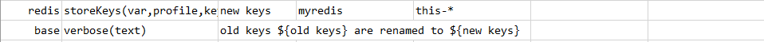
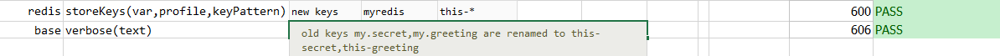

### Description
This command is used to find all keys matching the given `keyPattern` and store the matched keys to the given `var`.

### Parameters
- **var** - is the variable name where the retrieved matched keys to be stored. 
- **profile** - is the profile name with which `redis` database details are defined. (Refer [here](index.html#defining-profile) to know how to define `profile`)
- **keyPattern** - is the `pattern` to find the matching keys.

### Example
Supported patterns:
- h?llo matches hello, hallo and hxllo
- h*llo matches hllo and heeeello
- h[ae]llo matches hello and hallo, but not hillo
- h[^e]llo matches hallo, hbllo, ... but not hello
- h[a-b]llo matches hallo and hbllo

**Script**: 

**Output**: 

### See Also
- [`store(var,profile,key)`](store(var,profile,key))