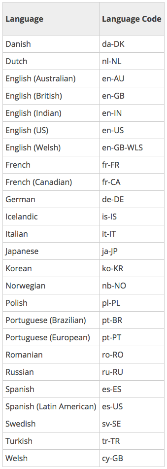

### Description
This command generates audio notification, just like other [sound commands](index). However this one is different in 
that it generates audio rendition of specified `text` via text-to-speech technology. By specifying `text`, this command
converts the audio equivalent, which can be purposed as an effective form of audio notification.


### Setup
Current implementation limits `text` to 500 characters since this has direct impact of the underlying AWS usage 
(and thus billing). Nexial utilizes 
<a href="https://aws.amazon.com/polly/" class="external-link" link="nexial_target">AWS Polly</a> 
as the underlying text-to-speech engine. To enable AWS Polly, the following configuration details must be provided:

| setting               | default     | explanation |
|-----------------------|-------------|-------------|
|`nexial.tts.region`    | `us-east-1` | (Optional) Specify the AWS region to use for the text-to-speech service. |
|`nexial.tts.accessKey` |             | [**REQUIRED**] Specify the AWS access key to use for the text-to-speech service. |
|`nexial.tts.secretKey` |             | [**REQUIRED**] Specify the AWS secret key to use for the text-to-speech service. |
|`nexial.tts.sampleRate`| 22050       | (Optional) The audio frequency specified in Hz. The valid values are `8000`, `16000` and `22050`. |
|`nexial.tts.language`  | en-GB       | (Optional) The language code of `text` to which to translate. Here are languages currently supported:<br/>  |

<br/>

The above settings can be configured via [Nexial Setup](../../userguide/BatchFiles#nexial-setup),
via command line and via `project.properties`. For example,

- via command line:
  ```batch 
  set JAVA_OPT=-Dnexial.tts.accessKey=... -Dnexial.tts.secretKey=...
  nexial.cmd -script ... ...
  ```
- via `project.properties`:
  ```properties
  nexial.tts.accessKey=...
  nexial.tts.secretKey=...
  nexial.tts.language=en-US
  ```

### Text Pattern
Nexial provides some "understanding" of the content of `text`. Here are some ways from which one can adjust the audio
rendering of the specified `text` in order to create a more natural appeal:

- pause - use `...` or `…` in your `text` to create slight delay. For example, `Well... I'm not sure what you mean` 
  would be rendered as "Well (pause) I'm not sure what you mean".
- emphasis - use UPPERCASE in your `text` to create vocal emphasis. For example, `Found another error AGAIN` would 
  render: "Found another error (emphasis)AGAIN".


### Parameters
- **text** - the text to transition to speech.


### Example


### See Also
- [sound &raquo; `laser(repeats)`](laser(repeats))
- [sound &raquo; `play(audio)`](play(audio))
