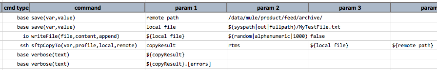
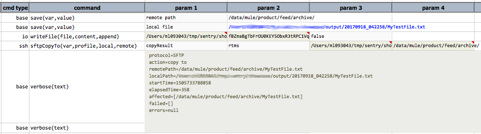

### Description
This command automates the copy of a local resource to a remote path via SFTP. The remote resource, if exist, will be overwritten.

For output process via `var`, check out [Command Output Processing](index#command-output-processing)

### Parameters
- **var** - the variable name that references the outcome of this command.
- **profile** - the profile that encapsulates the SSH connectivity and security information.
- **remote** - the pattern which specifies the folder, file or a pattern of files.
- **local** - the directory from which the files should be copied.

### Example
**Script**: 

**Output**: 

### See Also
- [`sftpCopyFrom(var,profile,remote,local)`](sftpCopyFrom(var,profile,remote,local))
