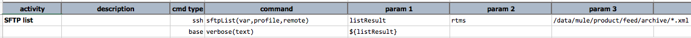

### Description
This command lists the remote files/directory via SFTP. 

For output process via `var`, check out [Command Output Processing](index#command-output-processing)

### Parameters
- **var** - the variable name that references the outcome of this command.
- **profile** - the profile that encapsulates the SSH connectivity and security information.
- **remote** - the pattern which specifies the folder, file or a pattern of files.

### Example
**Script**: 

**Output**: 
For listing the matching files on the remote server, use the following syntax:
${listResult}.affected

### See Also
- [`scpCopyTo(var,profile,local,remote)`](scpCopyTo(var,profile,local,remote))
- [`sftpCopyFrom(var,profile,remote,local)`](sftpCopyFrom(var,profile,remote,local))
