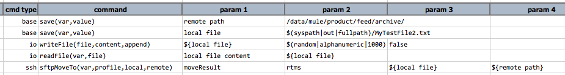
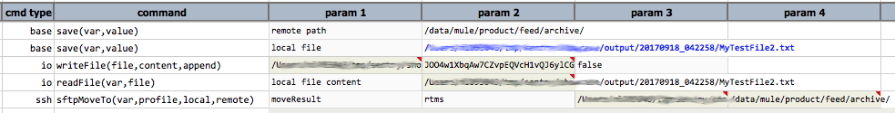

### Description
This command automates the moving of one or more local resources to a remote path via SFTP. The remote resource(s), 
if exist, will be overwritten. If `local` represents multiple files, then `remote` is expected to be a directory. 
Wildcard is supported - for example, `/my_folder/my_data/my_files*`.

For output process via `var`, check out [Command Output Processing](index#command-output-processing)

### Parameters
- **var** - the variable name that references the outcome of this command.
- **profile** - the profile that encapsulates the SSH connectivity and security information.
- **local** - the file(s) to move from a local directory (wilcard supported).
- **remote** - the target file or directory.

### Example
**Script**: 

**Output**: 

### See Also
- [`sftpMoveFrom(var,profile,local,remote)`](sftpMoveFrom(var,profile,remote,local))