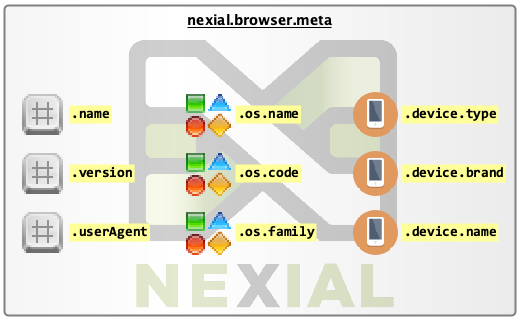

As of [Nexial v2.9](../../release/nexial-core-v2.9.changelog.md), Nexial exposes a set of metadata concerning the 
browser in execution.  Such metadata provides further insight concerning the browser in used for automation, such
as the browser version and if it is running in a desktop or mobile platform. This can be useful towards conditional 
execution and reporting.

To open a URL via Nexial, one would utilize one of the following commands:
- [web &raquo; `open(url)`](open(url))
- [web &raquo; `openAndWait(url,waitMs)`](openAndWait(url,waitMs))
- [web &raquo; `openHttpBasic(url,username,password)`](openHttpBasic(url,username,password))
- [web &raquo; `openIgnoreTimeout(url)`](openIgnoreTimeout(url))

Within each of these commands, Nexial will ensure that the browser metadata is also captured and stored to a System
variable named `nexial.browser.meta`. This means that the browser metadata will not be available for use until one of 
the above commands is invoked.

When the browser is closed via the [web &raquo; `closeAll()`](closeAll()) command or via 
the [web &raquo; `close()`](close()) command on the last window/tab, the same `nexial.browser.meta` System variable
will be removed. This allows one to utilize a different browser thereafter and for Nexial to capture the relevant
browser metadata accordingly.

One can inspect the browser metadata via the `nexial.browser.meta` System variable. The browser metadata has nested 
structure to expose information about the browser, the underlying operation system and device classification. Below is 
a graphical depiction of the metadata available during execution:

- `${nexial.browser.meta}.name` - the name of the browser currently in execution.
- `${nexial.browser.meta}.version` - the full version string of the browser currently in execution. 
- `${nexial.browser.meta}.userAgent` - the full identifier of the browser currently in execution. See 
  <a href="https://en.wikipedia.org/wiki/User_agent" class="external-link" target="_nexial_link">User agent</a> for 
  more details.
- `${nexial.browser.meta}.os.name` - the (marketing) name of the underlying operation system. For example, `iOS 8`, 
  `macOS 10.14 Mojave`, `Windows 10`.
- `${nexial.browser.meta}.os.code` - the code name of the underlying operation system. For example, `ios_8`, 
  `macos_10_14`, `windows_10`.
- `${nexial.browser.meta}.os.family` - the product family of the underlying operation system. For example, `Windows`, 
  `iOS`, `macOS`.
- `${nexial.browser.meta}.device.type` - the detected device type for the browser currently in execution. For example,
   `desktop`, `table`, `smartphone`.
- `${nexial.browser.meta}.device.brand` - the name of the device for the browser currently in execution. May be empty. 
  For example, `Apple`.
- `${nexial.browser.meta}.device.name` - the name of the device for the browser currently in execution. May be empty. 
  For example, `Mac`, `iPad`.

###### Note: Nexial uses <a href="https://userstack.com/" class="external-link" target="_nexial_external">Userstack</a> for browser metadata detection.
