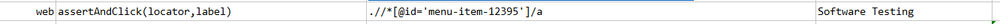
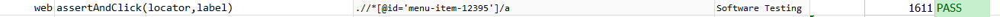

### Description
- This command asserts that the element exist with the specified `label` and if so, proceed to perform click event on 
the element.

### Parameters
- **locator** - this parameter is the xpath of the element.
- **label** - this parameter is the name of the element.

### Example
**Script**: 

**Output**: 

### See Also
- [`click(locator)`](click(locator).html)
- [`doubleClick(locator)`](doubleClick(locator).html)
- [`doubleClickAndWait(locator,waitMs)`](doubleClickAndWait(locator,waitMs).html)
