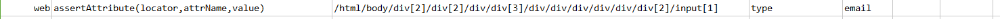

### Description

- This command it to assert the attribute of the web element.
- The command will pass if element found and required attribute is identified or fail otherwise.

### Parameters

- **locator** - this parameter if the xpath of the element.
- **attrName** - this parameter is the name of the attribute to be identified in the element.
- **value** - this parameter is the expected value of the attribute to be found in the element

### Example

**Script**: 

**Output**: 

### See Also