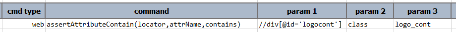
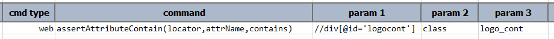

### Description
This command asserts that an attribute, denoted by `attrName`, belonging to an web element whose locator is
represented by `locator`, and that such attribute contains the value as specified in `contains`. 

If the specified attribute is not assigned to the target web element, then this respective step is marked as **FAIL**.
In other word, if an attribute does not exists, then it certainly does not "contain anything".

Optionally, one can use the `REGEX:` syntax to invoke regular expression as the matching mechanism. Let's see an
example:

```text
web | assertAttributeContain(...) | css=... | class | MyClass
```

The above asserts that the `class` attribute of the target web element does not contain `MyClass` in its value. In 
contrast, using regular expression we can assert multiple things and in more expressive ways:

This asserts that `class` contains `MyClass` or `YourClass`
```text
web | assertAttributeContain(...) | css=... | class | REGEX:(MyClass|YourClass)
```

This asserts that `class` contain one or more character, followed by `Class`
```text
web | assertAttributeContain(...) | css=... | class | REGEX:(.+Class)
```


### Parameters
- **locator** - the locator of the target web element
- **attrName** - the name of the attribute belonging to the web element
- **contains** - the text to verify against the value of the specified attribute


### Example
**Script**:<br/>


**Output**:<br/>



### See Also
- [`assertAttributeNotContain(locator,attrName,contains)`](assertAttributeNotContain(locator,attrName,contains))
- [`assertAttribute(locator,attrName,value)`](assertAttribute(locator,attrName,value))
- [`assertAttributeNotPresent(locator,attrName)`](assertAttributeNotPresent(locator,attrName))
- [`assertAttributePresent(locator,attrName)`](assertAttributePresent(locator,attrName))
- [`saveAttribute(var,locator,attrName)`](saveAttribute(var,locator,attrName))
