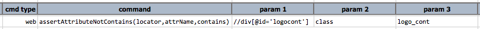
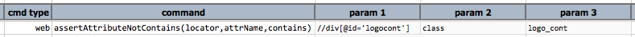

### Description

- This command asserts that an attribute, denoted by `attrName`, belonging to an web element whose locator is represented by `locator` \- such attribute **does not contain** the value as specified in `contains`.

### Parameters

- **locator** - the locator of the target web element
- **attrName** - the name of the attribute belonging to the web element
- **contains** - the text to verify against the value of the specified attribute

### Example

**Script**: 

**Output**: 

### See Also

- [`assertAttributeContains(locator,attrName,contains)`](assertAttributeContains(locator,attrName,contains).html)
- [`assertAttribute(locator,attrName,value)`](assertAttribute(locator,attrName,value).html)
- [`assertAttributeNotPresent(locator,attrName)`](assertAttributeNotPresent(locator,attrName).html)
- [`assertAttributePresent(locator,attrName)`](assertAttributePresent(locator,attrName).html)
- [`saveAttribute(var,locator,attrName)`](saveAttribute(var,locator,attrName).html)