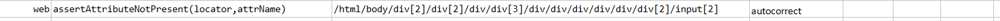

### Description

*   This command it to assert the attribute of the web element not present
*   The command will pass if attribute is not present in the element or fail otherwise.

### Parameter(s)

-  **locator** - this parameter if the xpath of the element.
-  **attrName** - this parameter is the name of the attribute to be not identified in the element.

### Example

Script:

Output:

### See Also