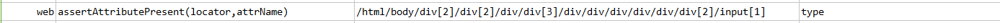

### Description

*   This command it to assert the attribute of the web element is present
*   The command will pass if desired attribute is present in the element or fail otherwise.

### Parameter(s)

- **locator** - this parameter if the xpath of the element.
- **attrName** this parameter is the name of the attribute to be identified in the element.

### Example

### See Also

*    [`web`](index.html)