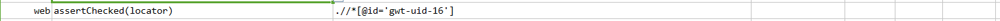
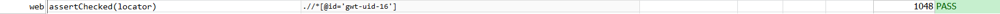

### Description

*   This command is to assert if the element is checked.
*   This is mostly useful to identify the checkbox or radio button element
*   The command will pass if required attribute is present and checked or fail otherwise.

### Parameter(s)

- **locator** - this parameter if the xpath of the element.

### Example

Script:

Output:

### See Also