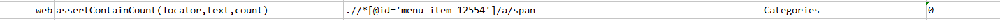
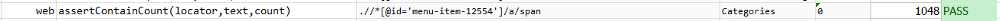

### Description

- This command is to assert the text count in that element
- In other words the command will identify the text count in the element as pass or else fail otherwise.

### Parameters

- **locator** - this parameter is the locator of the element.
- **text** - this parameter is the text of the element.
- **count** - this parameter is the total expected count of the text in the element.

### Example

**Script**: 

**Output**: 

### See Also

- [`assertTextPresent(text)`](assertTextPresent(text).html)
- [`assertTextContains(locator,text)`](assertTextContains(locator,text).html)
- [`verifyText(locator,text)`](verifyText(locator,text).html)