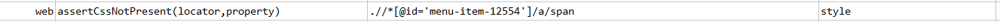
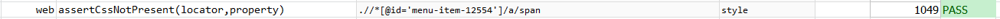

### Description

*   This command is to assert if any cascading style sheet not present in the element.
*   In other words command will assert if css not present for that element,The command will pass or else fail otherwise,

### Parameter(s)

- **locator** - this parameter is the locator of the element.
- **property** - this parameter is the css property which is not expected in that element.

### Example

Script:

Output:

### See Also

*   [`assertCssPresent(locator,property,value)`](assertCssPresent(locator,property,value).html)