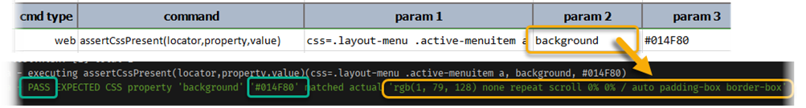
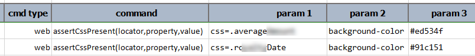

### Description
This command asserts the presence of a CSS `property` and its `value` (optional) for a given web element denoted by 
`locator`. As the command name suggests, the `property` parameter represents the CSS property to inspect, and the 
`value` parameter represents the expected value of the target CSS property. However, there are situations where the 
definition of a CSS property is important but the actual CSS value is immaterial. Note the following:

1. When `value` is specified as `*`, Nexial will **ONLY** assert the presence of the target CSS property. The actual CSS
   value will not be evaluated.
2. When `value` is specified as `(empty)` (meaning no value), Nexial will assert that the actual CSS value is also an 
   empty text.
3. To assert a color value (such as `background-color` or `color`), one may specify such value either as
   1. a HEX color value (i.e. `#rrggbb` or `#rgb`), 
   2. a "red-green-blue" value (i.e. `rgb(100,150,200)`), 
   3. a "red-green-blue-alpha" value (i.e. `rgba(100,150,200,0.5)`), or 
   4. one of the <a href="https://en.wikipedia.org/wiki/Web_colors#Extended_colors" 
      class="external-link" target="_nexial_link">extended color names</a>. 
4. If `value` is specified as a color (see above), then Nexial will attempt to convert the collected CSS property value
   as a color value as well. This means that if the specified CSS `property` is a shorthand - such as `background` or
   `border` - then Nexial will attempt to extract the color value out of such shorthand property and then perform the
   value comparison against expected `value`.  See below for an example, 
   
5. For color comparison, an alpha value (transparency) of **0** will ignore any actual RGB value since a fully 
   transparent color looks the same no matter the attached red, green or blue values.
6. If the specified `value` is not a color, then the collected CSS property value (aka "actual") will be evaluated as is. 

Any of the following will result in a FAIL for the corresponding step:
- If the specified web element cannot be found via the `locator`,
- If the specified CSS `property` cannot be found for the specified web element,
- If the expected color and the actual color are not both transparent and are not the same,
- If a non-empty `value` is specified but is not matching the derived value of the specified CSS `property`.



### Parameters
- **locator** - this parameter is the locator(xpath) of the element
- **property** - this parameter is the css property of the element
- **value** - this parameter is the expected value of the css property. Specify `*` to omit the value comparison

### Example
**Script**: 

### See Also
- [`assertAttributePresent(locator,attrName)`](assertAttributePresent(locator,attrName))
- [`assertCssNotPresent(locator,property)`](assertCssNotPresent(locator,property))
- [`saveAttribute(var,locator,attrName)`](saveAttribute(var,locator,attrName))
- [`saveAttributeList(var,locator,attrName)`](saveAttributeList(var,locator,attrName))
- [`saveCssValue(var,locator,property)`](saveCssValue(var,locator,property))
