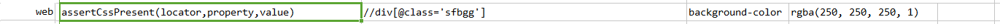
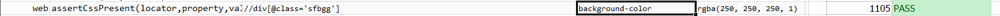

### Description

- This command is to assert cascading style sheet present for the element.
- In other words if element has the css present the command will pass or else fail otherwise.

### Parameters

- **locator** - this parameter is the locator(xpath) of the element
- **property** - this parameter is the css property of the element
- **value** - this parameter is the expected value of the css property.

### Example

**Script**: 

**Output**: 

### See Also

- [`web`](index.html)
- [`assertAttributePresent(locator,attrName)`](assertAttributePresent(locator,attrName).html)