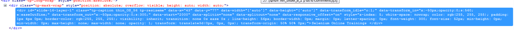
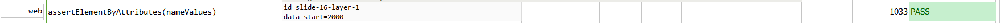

### Description

- This command is to assert Element by attributes of the element.
- In other words, the element would be asserted on the basis of attribute name provided as input parameters.
- Multiple   name values  can be provided in order to identify the element and assert it.
- The command assert the element and pass or else fail otherwise.

### Parameters

- **nameValues** - this parameter is the attribute name of the element.  
      
      
     
      
    

### Example

**Script**: 

**Output**: 

### See Also

- [`assertElementPresent(locator)`](assertElementPresent(locator).html)
- [`assertElementNotPresent(locator)`](assertElementNotPresent(locator).html)
- [`assertElementCount(locator,count)`](assertElementCount(locator,count).html)