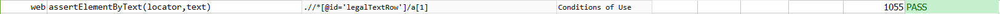

### Description

- This command will assert element as per the text present of the element.
- In other words the command will assert the desired text on the element and pass or else fail otherwise.

### Parameters

- **locator** - this parameter is the locator of the element.
- **text** - this parameter is the expected text on the element to be asserted,

### Example

**Script**: 

**Output**: 

### See Also

- [`assertElementNotPresent(locator)`](assertElementNotPresent(locator).html)
- [`assertTextPresent(text)`](assertTextPresent(text).html)
- [`assertElementByAttributes(nameValues)`](assertElementByAttributes(nameValues).html)