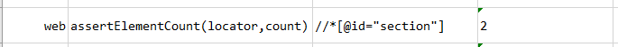
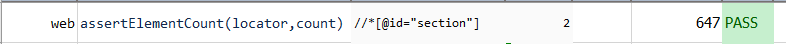

### Description

- This command is to assert the element count.
- In other words the command will find the count of the element  as per defined locator and pass or else fail otherwise.
- This command is useful if there is a need to find number of element found as per defined locator.

### Parameters

- **locator** - this parameter is to find the locator of the element.
- **count** - this parameter is the expected element count.

### Example

**Script**: 

**Output**: 

### See Also

- [`assertElementPresent(locator)`](assertElementPresent(locator).html)
- [`assertElementByAttributes(nameValues)`](assertElementByAttributes(nameValues).html)