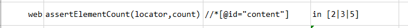
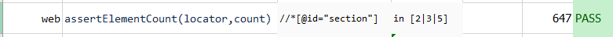

### Description
This command is to assert the count of element as per defined locator.
This command will find element count through locator and match with expected count specified via `count` and pass or fail accordingly.
The expected count can be specified as `Number` or [`Nexial Filters`](../../flowcontrols/filter). Specify filter on 
`count` parameter in following way.



### Parameters

- **locator** - this parameter is to find the locator of the element.
- **count** - this parameter is the expected element count which can specified as `number` or `Nexial filter`.

### Example

1. Parameter `count` specified as number 
**Script**: 
 
**Output**: 

2. Parameter `count` specified as Nexial Filter 
**Script**: 
 
**Output**: 

### See Also

- [`assertElementPresent(locator)`](assertElementPresent(locator))
- [`assertElementByAttributes(nameValues)`](assertElementByAttributes(nameValues))