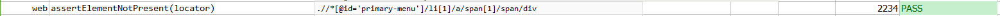

### Description

- This command is to assert is the element is not present as per the defined locator.
- In other words command will look for element not present as per the locator and pass or else fail otherwise.

### Parameters

- **locator** - this parameter is the locator of the element which does not exist i=on the page.

### Example

**Script**: 

**Output**: 

### See Also

- [`assertElementPresent(locator)`](assertElementPresent(locator).html)
- [`assertAttributePresent(locator,attrName)`](assertAttributePresent(locator,attrName).html)