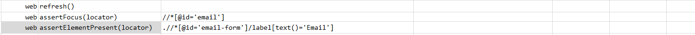
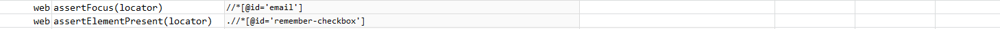

### Description

- This command it to assert element on the web page.
- The command will pass if element  is present or fail otherwise.

### Parameters

- **locator** - this parameter is the xpath of the element.

### Example

**Output**: 

### See Also

- [`web`](index.html)