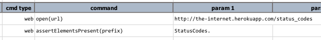
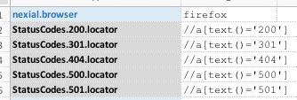

### Description
This command instructs Nexial to harvest a set of data variables that match to the form of `[prefix]...locator` and
use the value of such data variables as locators to assert the presences of one or more web elements. `[prefix]` will
be specified via the first parameter. Such data variables **must** end with `.locator`. The corresponding data variables 
can contain any of the [supported locators](index#locators).

Note that this command will attempt to assert all locators regardless of the presence of each targeted web element. It
will FAIL if one or more target web elements ia not found. In other words, it will only PASS if all web elements as 
indicated by the gathered locators are found.

Depending on [`nexial.verbose`](../../systemvars/index#nexial.verbose), a `true` value would cause Nexial to output
additional validation output. But `false` (default) will result in error-only output in the execution result.

### Parameters
- **prefix** - the prefix to consider to gather a set of data variables that contain locator for "element presence" test.

### Example
Script: 

Data File: 

**Note:** be sure to specify `prefix` correctly. In the above case, the prefix is `StatusCodes.` (ending with dot) 
in order to gather all 5 locators.

### See Also
- [`assertElementPresent(locator)`](assertElementPresent(locator))
- [`web`](index.html)