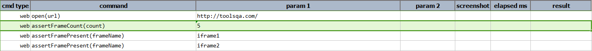
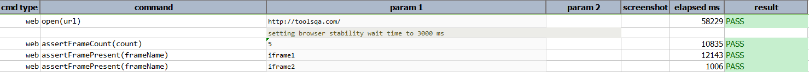

### Description

- This command is to assert frame count on the page.
- In other words the command will verify count of the frame on the page and pass or else fail otherwise.

### Parameters

- **count** - this parameter is the expected frame count on the page.

### Example

**Script**: 

**Output**: 

### See Also

- [`assertFramePresent(frameName)`](assertFramePresent(frameName).html)