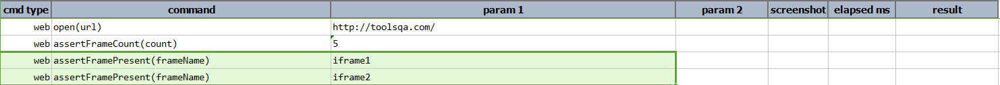
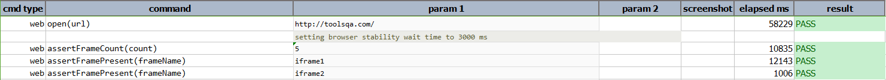

### Description

- This command is to assert Frame Present on the page.
- In other words command will find frame present on page as per the frame name defined as input Parameters.
- The command will pass if the frame found or else fail otherwise.

### Parameters

- **frameName** - this parameter is the expected frame to be looked on the page.

### Example

**Output**: 

### See Also

- [`assertFrameCount(count)`](assertFrameCount(count).html)