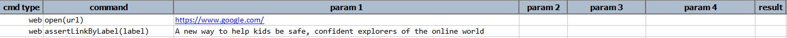
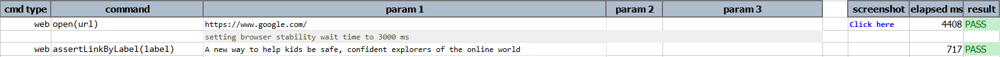

### Description

- This command is to assert the link with label.
- In other words the command will assert the link by label of the text and pass or else fail otherwise.

### Parameters

- **label** - this parameter is the label name of the element.Actual Ui label displayed for the link

### Example

**Script**: 

**Output**: 

### See Also

- [`assertText(name,text)`](assertText(locator,text).html)