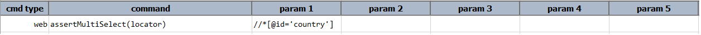
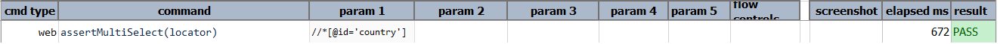

### Description
This command asserts the select element support multiple select options.

### Parameters
- **locator** - locator of the target select element.

### Example
**Script**: 
.

**Output**: 
.

### See Also
- [`assertSingleSelect(locator)`](assertSingleSelect(locator).html).