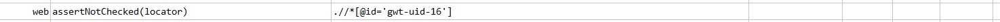
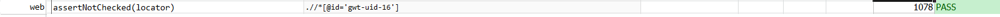

### Description

- This command is to assert if the element is not checked.
- This is mostly useful to identify the checkbox or radio button element for not checked
- The command will pass if required attribute is present and unchecked or fail otherwise.

### Parameters

- **locator** - this parameter if the xpath of the element.

### Example

**Script**: 

**Output**: 

### See Also