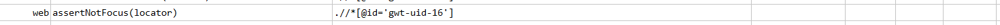

### Description

- This command is to assert if the focus is not on the element.
- The command will pass in the focus is not on the element or else fail otherwise.

### Parameters

- **locator** - this parameter if the xpath of the element.

### Example

**Script**: 

**Output**: 

### See Also