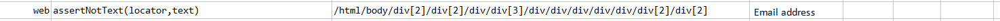
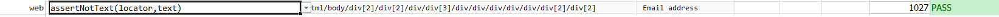

### Description
This command asserts that the desired text is not found on the element.  The command will pass if desired text not 
found or else fail otherwise.

### Parameters
- **locator** - this parameter if the xpath of the element.
- **text** - this parameter is the text no expected to be found on that element.

### Example
**Script**: 

**Output**: 

### See Also