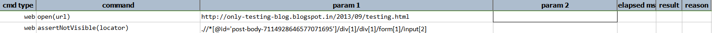
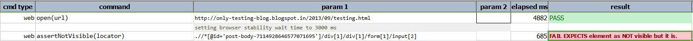

### Description

- This command is to assert element if not visible on the page.
- In other words this command will assert the element on the page with is available but not visible.
- The command will look for the element and assert for not visible if found the command will pass or else fail otherwise.

### Parameters

- **locator** - this parameter is the locator of the element.

### Example

**Output**: 

### See Also

- [`assertVisible(locator)`](assertVisible(locator).html)