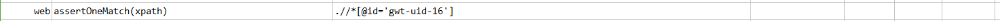
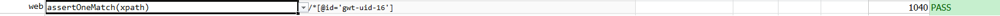

### Description

- This command is to make sure and assert only one instance of element is present.
- In other words if we defined locator if there is only one match found then command will pass or else fail otherwise

### Parameters

- **locator** - this parameter if the xpath of the element.

### Example

**Script**: 

**Output**: 

### See Also

- [`web`](index.html)