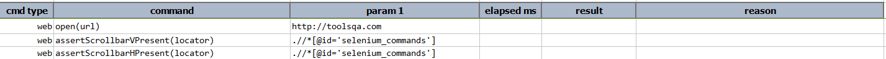
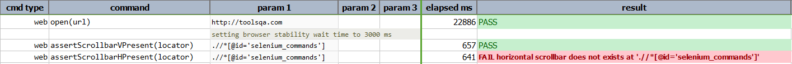

### Description

- This command is to verify if element contains horizontal scroll bar.
- In other words the command will pass if the element has horizontal scroll bar or else fail otherwise.

### Parameters

- **locator** - this parameter is the locator of the element.

### Example

**Script**: 
      

**Output**: 

### See Also

- [`assertScrollbarVPresent(locator)`](assertScrollbarVPresent(locator).html)