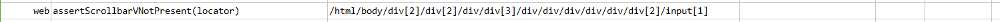
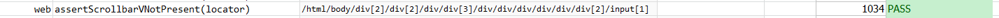

### Description

- This command will look for Vertical scroll bar not present in element.
- If there are no vertical scroll bar found in element, the command will pass or else fail otherwise.

### Parameters

- **locator** - this parameter if the xpath of the element.

### Example

**Script**: 

**Output**: 

### See Also

- [`web`](index.html)