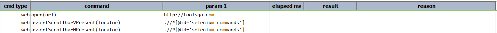
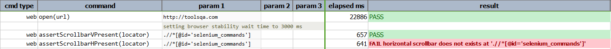

### Description

- This command is to verify if element contains Vertical scroll bar.
- In other words the command will pass if the element has vertical scroll bar or else fail otherwise.

### Parameters

- **locator** - this parameter is the locator of the element.

### Example

**Output**: 

### See Also

- [`assertScrollbarHPresent(locator)`](assertScrollbarHPresent(locator).html)