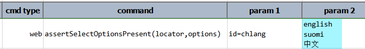

### Description
This command asserts that the specified `options` can be found in the `SELECT` element as denoted by `locator`. Note 
that the `options` parameter is expected to represent the text of the `OPTION` elements under the target `SELECT` 
element, not the `value` attribute of the `OPTION` elements. Each of the `OPTION` text is separated by 
[`nexial.textDelimi`](../../systemvars/index.html#nexial.textDelim) or a newline character. For example,

The highlighted (blue) portions are the text of the `OPTION` elements mentioned above. So, if one desires to assert that
this `SELECT` element contains, say, `english`, `suomi` and `中文`, the following would be the use of this command:

As shown above, the target `OPTION` text is separated into individual line.  

The corresponding step is considered as FAIL if:
- If the target `SELECT` element does not contain one or more of the specified `OPTION` text. 
- If the target `SELECT` element contains no `OPTION` child element.

### Parameters
- **locator** - the locator of the target `SELECT` element.
- **options** - the text of the child `OPTION` element(s) of the target `SELECT` element.

### See Also
- [`assertAttribute(locator,attrName,value)`](assertAttribute(locator,attrName,value))
- [`assertElementNotPresent(locator,maxWaitMs)`](assertElementNotPresent(locator,maxWaitMs))
- [`assertElementPresent(locator)`](assertElementPresent(locator))
- [`assertSelectOptionsAbsent(locator,options)`](assertSelectOptionsAbsent(locator,options))
- [`deselect(locator,text)`](deselect(locator,text))
- [`deselectMulti(locator,array)`](deselectMulti(locator,array))
- [`select(locator,text)`](select(locator,text))
- [`selectMulti(locator,array)`](selectMulti(locator,array))
- [`selectMultiByValue(locator,array)`](selectMultiByValue(locator,array))
