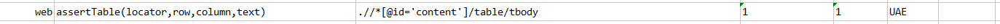
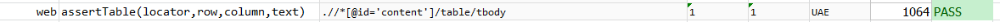

### Description
This command asserts the value of a table cell based on the `locator` of the said table and the `row`/`column` position 
of the said cell. Unlike most of Nexial commands, both `row` and `column` are 1-based position (i.e. first column 
would be `1`, second would be `2`, and so on).

### Parameters
- **locator** - locator of the target table component.
- **row** - 1-based target row position.
- **column** - 1-based target column position.
- **text** - the text to assert against the target cell.

### Example
**Script**: 

**Output**: 

### See Also
- [`assertTextPresent(text)`](assertTextPresent(text).html)
- [`assertElementPresent(locator)`](assertElementPresent(locator).html)