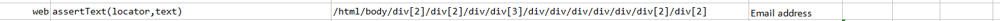
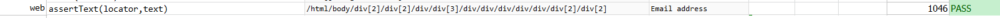

### Description

- This command is to assert text of the element.
- In other words command will assert the text if found or else fail otherwise.

### Parameters

- **locatorScript** - this parameter is the locator of the element.
- **text** - this parameter is the text to be asserted.

### Example

**Script**: 

**Output**: 

### See Also
- [`assertNotText(locator,text)`](assertNotText(locator,text))
- [`assertTextContains(locator,text)`](assertTextContains(locator,text))
- [`assertTextMatches(text,minMatch,scrollTo)`](assertTextMatches(text,minMatch,scrollTo))
- [`assertTextNotContain(locator,text)`](assertTextNotContain(locator,text))
- [`assertTextNotPresent(text)`](assertTextNotPresent(text))
- [`assertTextPresent(text)`](assertTextPresent(text))
- [`verifyText(locator,text)`](verifyText(locator,text).html)