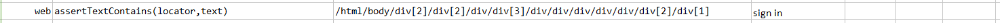

### Description
This command asserts that the specified `text` is found in the specified element.

### Parameters
- **locator** - this parameter if the xpath of the element.
- **textScript** - this parameter is the text to be found in element.

### Example
Script: 

Output: 

### See Also
