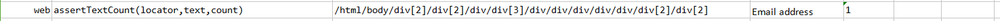

### Description

- This command is to assert the text count found in the element.
- In other words the command will find the text and the count of text  identified using defined locator
- The command will pass if the actual text count matches with the expected text count or else fail otherwise.

### Parameters

- **locatorScript** - this parameter is the locator(xpath) of the element.
- **text** -  this parameter is the text to be identified using locator.
- **count** - this parameter is the expected count of the text 

### Example

**Script**: 

**Output**: 

### See Also

- [`web`](index.html)