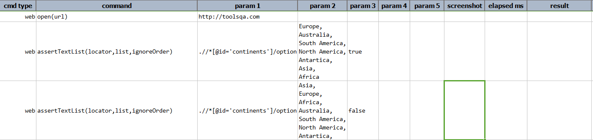
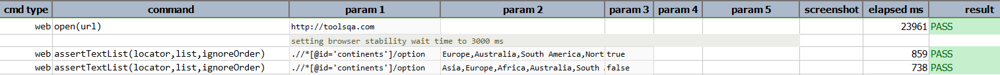

### Description

- This command is to assert the item of the list box.
- In other words the command will assert the item of the list box as per the expected list and will pass or else fail otherwise.

### Parameters

- **locator** - this parameter is the locator of the element to be identified.
- **list** - this parameter is the expected item in ListBox.
- **ignoreOrder** - this parameter is the Boolean value for order of the list.The parameter should be "true" or false"

### Example

**Script**: 

**Output**: 

### See Also

- [`assertTextPresent(text)`](assertTextPresent(text).html)
- [`assertText(locator,text)`](assertText(locator,text).html)
- [`assertTextOrder(locator,descending)`](assertTextOrder(locator,descending).html)