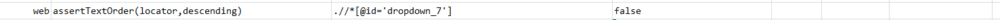
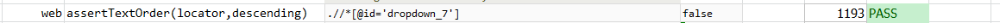

### Description

- This command is to assert text order of the element.
- In other words the command will assert the order of the text in the element and will check as per the descending order defined.
- The command will pass if the text found with the descending order defined or else fail otherwise.

### Parameters

- **locator** - this parameter is the locator of the text element to be found.
- **descending** - this parameter is the order in with the text is expected.The Boolean value true or false need to be defined here.

### Example

**Script**: 

**Output**: 

### See Also

- [`assertTextPresent(text)`](assertTextPresent(text).html)