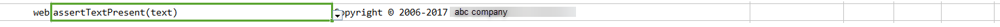

### Description
This command asserts if the defined `text` is present on current page.

### Parameters
- **text** - this parameter is the actual text to be found on the page.

### Example
**Script**: 

**Output**: 

### See Also
- [`assertNotText(locator,text)`](assertNotText(locator,text))
- [`assertText(locator,text)`](assertText(locator,text))
- [`assertTextContains(locator,text)`](assertTextContains(locator,text))
- [`assertTextMatches(text,minMatch,scrollTo)`](assertTextMatches(text,minMatch,scrollTo))
- [`assertTextNotContain(locator,text)`](assertTextNotContain(locator,text))
- [`assertTextNotPresent(text)`](assertTextNotPresent(text))
- [`assertTextPresent(text)`](assertTextPresent(text))
- [`verifyContainText(locator,text)`](verifyContainText(locator,text))
- [`verifyText(locator,text)`](verifyText(locator,text).html)
