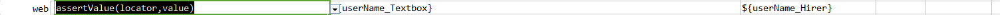
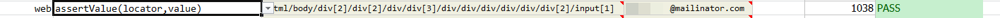

### Description

*   This command is to assert value of the element found as per the locator.
*   The command will pass if the value matches with the expected or else fail otherwise.

### Parameter(s)

- **locator** - this parameter is the locator of the element.
- **value** -  this parameter is value to be found in the element and asserted.

### Example

Script:

Output:

### See Also

*    [`web`](index.html)
*   [`assertVisible(locator)`](assertVisible(locator).html)