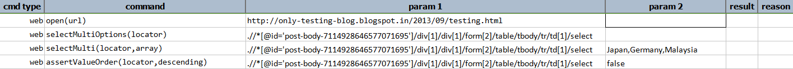
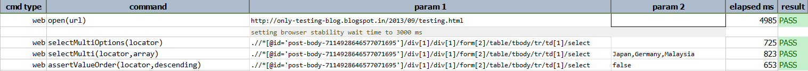

### Description

*   This command is to assert the order of the item in listbox.
*   In other words the  the command will assert the order of the value in listbox is as expected or not and pass the command or else fail otherwise.

### Parameter(s)

- **locator** - this parameter is the locator of the element.
- **descending** - this parameter is the value to order.The input has to true or false.

### Example

script

output:

### See Also

*   [`selectMultiOptions(locator)`](selectMultiOptions(locator).html)
*   [`selectMulti(locator,array)`](selectMulti(locator,array).html)
*   [`deselectMulti(locator,array)`](deselectMulti(locator,array).html)