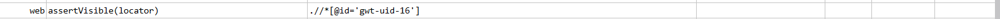
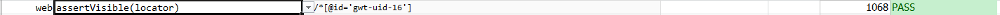

### Description

- This command is to assert if element is visible on the page.
- In other words is element is visible on the page,the command will pass or else fail otherwise.

### Parameters

- **locator** - this parameter is the locator(xpath) of the element to be found.

### Example

**Script**: 

**Output**: 

### See Also

- [`assertNotVisible(locator)`](assertNotVisible(locator).html)