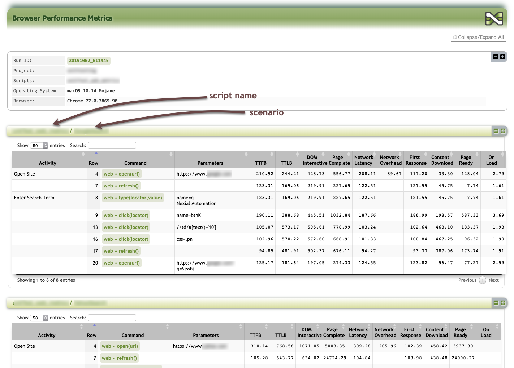
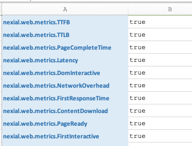

### Description
As of [v2.7](../../release/nexial-core-v2.7.changelog), Nexial supports the capturing of browser performance metrics 
during an execution. These metrics correspond to the browser's activities to handle the response from the server and 
the performance thereof. This is sometimes referred to as "Client-side Performance Metrics", which is different than 
the "Server-side Performance Metrics". The server-side performance testing, often done through performance testing tools 
like JMeter or Gatling, focuses mainly on the responsiveness and resilience of the web server or web application over 
varying concurrent request load. Client-side performance testing, on the other hand, focuses on the user experience 
through the vantage point of the client application. Both types of performance metrics are important and in isolation 
neither tells the complete story on application performance.

Performance matters! Using a slower application is almost always a worse user experience than a faster one (all other 
things being equal). When analyzed alongside server-side performance metrics, one gains the right perspective in terms 
of user experience, bottlenecks and optimization opportunity.

In terms of browser performance metrics (just _metrics_ hereafter), there are general 3 categories of data we can 
gather (excerpt from <a href="http://siusin.github.io/perf-timing-primer/" class="external-link" target="_nexial_link">
A Primer for Web Performance Timing API</a>):



-----

### What does it look like?
When metrics collection is enabled, Nexial will gather the metrics along the way during the execution. When the 
execution is completed, the metrics is transformed into a HTML file - `browser-metrics.html` - a "dashboard" of sorts, 
and placed in the [output](../../userguide/UnderstandingProjectStructure#output) directory. It looks as follows 
(subject to changes):

 

The metrics is separated by the corresponding script/scenario into an interactive grid structure equipped with search 
and sort capabilities. One can use the metrics presented in these grids to analyze the browser performance when it was
used during automation.

Future version of the metrics dashboard will include charts and historical comparison. _Stay tuned!_

-----

### How do I get started?
Here are the steps to follow to enable metrics collection:
1. Add the System variable `nexial.web.metrics.enabled` and set its value to `true`.
2. Add the desired metrics by the associated System variable names and set them to `true`. These System variables can
   be found in the <a href="javascript:void(0);" onclick="scrollToTab('tab_title_navigation','description')">Navigation 
   Timing</a>. For example, 
   
3. That's it! Nexial will collect the specified metrics on the "action" Web commands (i.e. not `assert...` or 
   `validate` commands).

-----

### References
<ul>
<li><a href="https://developers.google.com/web/fundamentals/performance/critical-rendering-path/measure-crp" class="external-link" target="_nexial_link">Measuring the Critical Rendering Path</a></li>
<li><a href="https://developers.google.com/web/fundamentals/performance/user-centric-performance-metrics" class="external-link" target="_nexial_link">User-Centric Performance Metrics</a></li>
<li><a href="https://developers.google.com/web/tools/chrome-devtools/network/understanding-resource-timing" class="external-link" target="_nexial_link">Understanding Resource Timing</a></li>
<li><a href="https://community.akamai.com/customers/s/article/Using-Navigation-Timing-APIs-to-understand-your-webpage?language=en_US" class="external-link" target="_nexial_link">Using Navigation Timing APIs to understand your webpage</a></li>
<li><a href="https://gtmetrix.com/blog/first-contentful-paint-explained/" class="external-link" target="_nexial_link">First Content Paint Explained</a></li>
<li><a href="https://www.sitepen.com/blog/improving-performance-with-the-paint-timing-api/" class="external-link" target="_nexial_link">Improving Performance with the Paint Riming API</a></li>
</ul>
