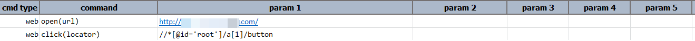
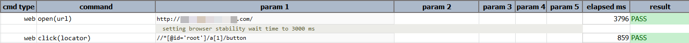

### Description
This command clicks on the target element as specified via `locator`. If the locator does not resolve to a valid web
element, this command will consider it as a FAIL. If the specified locator resolves to multiple web elements, only the
first one will be clicked.

At times, it is beneficial to perform the click action via JavaScript (i.e. `element.click()`) rather than the 
conventional Selenium/WebDriver technique. Some web applications, esp. more modern ones, contain "event listeners" to 
trap the click events so that certain JavaScripts code can be executed in response.  As such, using JavaScript to 
perform the click might yield a more stable and predictable results upon such application (or website). This differs 
from applications to applications, and would most likely depends on its underlying web framework. To enable 
JavaScript-based click, set [`nexial.browser.forceJSClick`](../../systemvars/index#nexial.browser.forceJSClick) to 
`true`. 

Sometimes, again depending on the target applications, it might not be advisable to perform screenshot capture 
after the click command. Some application might need time to "settled down" before further navigational or automation 
actions can be performed upon it. This is especially true when a click command results in the rendering of a new tab or 
new window. When possible, it is probably to perform screenshot capture **after** the click command -- that means, 
mark the "screenshot" column with `x`.

### Parameters
- **locator** - this parameter is the xpath of the element on which action need to be performed.

### Example

**Output**: 

### See Also
- [`clickAndWait(locator,waitMs)`](clickAndWait(locator,waitMs).html)
- [`clickByLabelAndWait(label,waitMs)`](clickByLabelAndWait(label,waitMs).html)
- [`clickByLabel(label)`](clickByLabel(label).html)
