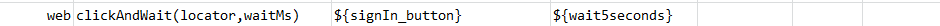
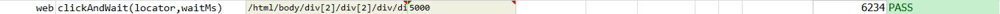

### Description
This command instructs Nexial to click on the first element that matched to the specified `locator`, and wait for 
`waitMs` milliseconds.

### Parameters
- **locator** - the locator of the element on which action need to be performed
- **waitMs** - the time to wait, in milliseconds.

### Example
**Script**: 

**Output**: 

### See Also
- [`click(locator)`](click(locator))
- [`clickAll(locator)`](clickAll(locator))
- [`clickByLabel(label)`](clickByLabel(label))
- [`clickByLabelAndWait(label,waitMs)`](clickByLabelAndWait(label,waitMs))
- [`clickIfPresent(locator)`](clickIfPresent(locator))
- [`clickOffset(locator,x,y)`](clickOffset(locator,x,y))
- [`clickWithKeys(locator,keys)`](clickWithKeys(locator,keys))
